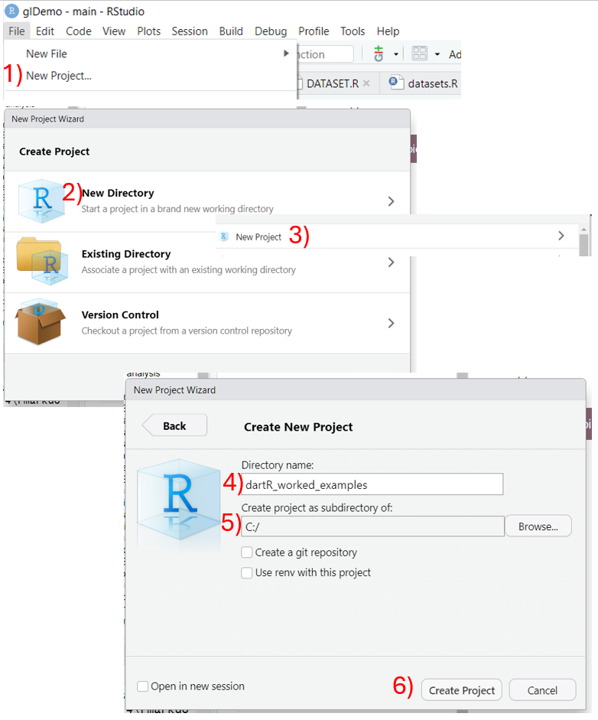
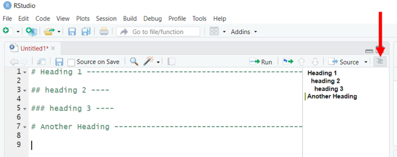

```{r setup, include=FALSE}
knitr::opts_chunk$set(
	echo = TRUE,
	message = FALSE,
	warning = FALSE
)

#necessary to render tutorial correctly
library(learnr) 
library(htmltools)
#options(repos = BiocManager::repositories())
library(dartR.data)
library(dartR.base)
gl.set.verbosity(3)

library(dartRintro) # for tutorial data

```


## Introduction {data-progressive=FALSE} 

This is your hands on introduction to [dartR](https://github.com/green-striped-gecko/dartRverse?tab=readme-ov-file#dartrverse-). The worked examples and exercises in this tutorial correspond to the [[Intro to dartR ebook](http://dartr.biomatix.org/dartR)]{style="color:#ff0000;"}. There are also accompanying [AI podcast summaries](https://public.3.basecamp.com/p/Dp1F2egZGXY5siDf1MPFqyyg) for all the chapters, which you should definitely check out if you are more of an auditory learner.

If you can't see the left sidebar, you just need to make the tutorial panel wider.

### 

### R code box

Throughout this tutorial there will be interactive R scripts/consoles (like the one below). This is like a mini version of R running within this tutorial. But since we are already in R, you can also follow along in your own console and start writing your own code in the source panel. You could even try testing some of what you learn on your own data.

But first, try running the code below (press the button that says *run code*)

```{r ex, exercise=TRUE}
# Press the Run Code button to run this code
1+1
```

```{r ex-solution}
# This is an example of the interactive component 
#of this tutorial. 

# Try running some code and testing out the three buttons:
#  - Run Code, 
#  - Start Over, 
#  - and Solution

```

###

Did you notice the tick that is showing before the *R cod box* heading after running the code?

### 

It is worth noting that each R code box is independent, so code you ran in one will not be recognised by another. Don't worry though, we have done some fancy coding in the background for you to continue along, keeping track of the tasks performed before hand. 

Any troubles or tribulations with coding in dartR, we have a great community that can be found on the [dartR google group](https://groups.google.com/g/dartr).

### 

Some of the exercises within this tutorial are specific to your working environment or Rstudio, these types of exercises will be surrounded by a green box, like the one below.

::: {.my-solution icon="false"}
It might be loading in data, or setting the working directory, or creating an R project.

They need to be run in your console.
:::

### 

While going through the worked examples your progress will be saved, if at any point you would like to refresh the tutorial and start over, the <small>[Start Over]{style="color:#a3a3a3; font-family:'Jaldi', sans-serif;"}</small> button is located at the very bottom of the left sidebar, below the tutorial content.

### 

One final note, don't forget that all aspects of the material are beneficial for learning. The ebook for being introduced to the theory and methods, the worked examples to gain experience in the application, and finally the exercises to apply everything you have learned.

Alright! Let's introduce you to the data we will be using throughout these worked examples in the Next Topic. After that head back to the ebook and get ready to start working through the worked examples and exercises back here when prompted.

<p>Good luck on your Pop Gen journey! 😁</p>

## The data

[<small>*Data modified for educational purposes*</small>]{style="color:grey"}

*Tympanocryptis lineata*, the Canberra grassland earless dragon, is endemic to Australian natural temperate grasslands (Smith et al. 1999; Scott and Keogh 2000; Melville et al. 2007; Hoehn et al. 2010; Robertson et al. 2010; Stevens et al. 2010). It is fittingly named the grassland earless dragon because of its lack of external ear openings and functional tympanum (Robertson et al. 2010). Canberra grassland earless dragons, hereafter also referred to as dragons, are a foraging species consuming a diet of predominantly ants and other invertebrates. They use a sit-and-wait approach to predate on their prey (McGrath et al. 2014). Their movement is typically no greater than 100 metres every six weeks, with localised home ranges between 925m2 and 4668m2 (Stevens et al. 2010; Hoehn et al. 2013; McGrath et al. 2014). There are only a few remaining fragmented populations found in and around Canberra (Stevens et al. 2010; Nelson and Cooper 2017).  

{.class height="450"}

Nationally it is classed as endangered under the Environmental Protection and Biodiversity Conservation Act 1999 (ACT Government 2017). Monitoring of this species in the ACT began in Northern Canberra in 2002 and Western Canberra in 2006. A rapid decline in capture numbers for both populations was detected somewhere between 2004 and 2006 (Dimond et al. 2012; Hoehn et al. 2013) and more generally across several sites in the Canberra region from 1995 to 2009. The dragons have continued to decline raising conservation concern.

Genetic samples have been collected since 2006 and now is a good time to assess the status of the remaining populations. Given the low number of individuals remaining in the wild, managements main concern is whether the dragons are losing genetic diversity. You have been tasked in providing the management team with an assessment of the genetic status of the species. 


```{r echo=FALSE}
#devtools::install_github("r-spatial/mapview")
#gl.map.interactive(tympo.gl)

library(leaflet)

m<-leaflet() %>% addCircles(lng = tympo.gl@other$latlon$lon,
                         lat = tympo.gl@other$latlon$lat,
                         color = c('red', 'blue','green', 'white', 'yellow')[as.numeric(tympo.gl@pop)]) %>% 
  addTiles(urlTemplate = 'http://{s}.tile.openstreetmap.org/{z}/{x}/{y}.png')
 m 
```

The following worked examples will walk you through the process of analysing genetic data to be able to answer whether or not the genetic diversity is decreasing in this critically endangered small agamid lizard. 

To coincide with the *Introduction to dartR: A Practical Guide* ebook, the worked examples have been broken up into steps:

1. Getting setup in RStudio

2. Coding in R - individual metrics

3. Genetic data structure and input

4. Genetic data manipulation

5. Basic filtering

6. Simple visualisation


## Worked Ex 1-1: Getting organised
###

A good first step on any data analysis journey is to get a little organised. RStudio's projects are a great way to do that. Let's create a project for our grassland earless dragon analysis (we will use the same project for all the worked examples).

### Create RStudio project

You can create a project in six easy steps (see fig below):

  1. Navigate to the [File]{style="color:#a3a3a3; font-family:'Arial'"} tab at the top of RStudio and select [New Project...]{style="color:#a3a3a3; font-family:'Arial'"} 
  
  2. Select **New Directory**
  
  3. Then select [New Project]{style="color:#a3a3a3; font-family:'Arial'"} at the top of the list
  
  4. The next step is to name your project (i.e. folder name - how about *dartR_tympos*)
  
  5. Then choose a location on your computer where you want to store your ([Browse...]{style="color:#a3a3a3; font-family:'Arial'"} for easy navigation)
  
  6. Finally, all you need to to is press **Create Project**
  
  
{.class height="750"}

### Folder structure

The next way to get organised is to have a good folder system, this is the folder system I recommend. 

- code (r scripts)

- data (raw data - READ ONLY)

- figures (figures created)

- output (data created)

You might have additional folders but these are a good start.

you can run the below code to generate the folders 

```{r eval=FALSE}
lapply(c('code', 'data', 'figures', 'output'), dir.create)
```

### Organising scripts

A nice aspect of RStudio's R editor is that it has a way to create sections within your code, similar to word's headings functions. First open a new file: [File | New File | R Script]{style="color:#a3a3a3; font-family:'Arial'"}  

To define a heading you use hash symbols (# = level 1 heading, ## = level 2 heading, etc...) followed by the heading name and then at least four dashes. 

Here is an example of what it would look like

```{r}
# Heading 1 ------------------

## heading 2 ----

### heading 3 ----
```

You can also use ctrl + Shift + R as a shortcut to define level 1 headings.

What is nice is that then if you click on the outline at the top-right of your R script (indicated by the red arrow below) it will show you the headings in your script and you can also use it to navigate to different parts of your code by clicking on the headings in the outline.



These are all just ways to help you keep organised. Apply them as you see fit. 

Now lets get into some actual coding!

## Worked Ex 2-1: Data types

The first step is to get an overview of our samples. To do this lets use the dragon's individual metrics data. But before jumping in, let's get a bit of an overview of how R works.

R works with objects, that is, with self-contained entities that have defined attributes. The advantage of objects is that when you use one in calculations, R knows what it is and how to handle it in the calculations.

When you create an object in R, attributes are assigned to it by default. The decision is made behind the scenes. 

### Scalars (contains a single value)

Let's define our first R object, we want to keep track of the species name we are working with. Fill in the species name (...) below and then check the class of your new R object by typing in `species` into the brackets (...). If you are unsure you can click the solutions tab

```{r extwo1, exercise=TRUE}
species <- '...'
species
class(...)
```

```{r extwo1-solution}
species <- 'Tympanocryptis lineata'
species
class(species)
```

Next, we want to define the year when we started collecting tissue samples. Fill in the code similar to above, but in R numbers do not need quotation marks ('').

```{r extwo2, exercise=TRUE}
year <- ...
year
class(...)
```

```{r extwo2-solution}
year <- 2006
year
class(year)
```

You should see that R has automatically assigned the species name as a character and the first sampling year as numeric. Let's keep track of one more piece of information that is recognised by R in a distinct way. Indicate below if the dragon is classed as endangered using either `TRUE` or `FALSE`. Then check the class of this new R object.

```{r extwo3, exercise=TRUE}
endangered <- ...
endangered
class(...)
```

```{r extwo3-solution}
endangered <- TRUE
endangered
class(endangered)
```

As you should be able to see, this is a logical variable. This is a key part of coding and will come up a lot when manipulating data.


### Vectors (containing ordered set of values of the same type)

Now let's define another type of R object, that can include more than a single value, to keep track of the first five dragons captured. We will need three vectors, the first containing their ids(AA1-AA5), second their age (J, J, SA, A, SA), and third their snout-vent-length in mm (36,33,38,66,45). We use `c()` to define vectors. Fill in the code below with the information provided for the five dragons. Don't forget to include quotations around anything that is not a number. 

When you assign values there is no output, so if you want to see the results of what you have created don't forget to put the name of your R object on a new line, like we have done below.


```{r extwo4, exercise=TRUE}
ids <- c(...)
age <- c(...)
svl <- c(...)
ids
age
svl
```

```{r extwo4-solution}
ids <- c('AA1', 'AA2', 'AA3', 'AA4', 'AA5')
age <- c('J', 'J', 'SA', 'A', 'SA')
svl <- c(36, 33, 38, 66, 45)
```

Vectors can be subset using square brackets `[]`. Let's first just look at our adult dragons length. It is the fourth dragon in our vector list so we would place 4 within the brackets. We can even remove the adult in the same fashion, just by adding a minus symbol, -4. 

```{r extwo5, exercise=TRUE}
svl <- c(36, 33, 38, 66, 45)
svl[...]
```

```{r extwo5-solution}
svl <- c(36, 33, 38, 66, 45)
svl[4]
svl[-4]
```

Another useful coding convention is the colon `:`, we can use it to access the juvenile lengths, the first two dragons in our list. The colon is a way to easily create a sequential string of numbers. How about also trying to subset just the last three dragons as well, the non-juveniles. 

```{r extwo6, exercise=TRUE}
svl <- c(36, 33, 38, 66, 45)
svl[...:...] #Juveniles
svl[...:...] #adults and sub-adults
```

```{r extwo6-solution}
svl <- c(36, 33, 38, 66, 45)
svl[1:2] #Juveniles
svl[3:5] #adults and sub-adults
```

What about only sub-adults. For them we would need to define positions 3 and 5 using `c()` within the square brackets. Another way to access parts of a vector are using conditional statements. Conditional statements produce logical outputs. Let's try the *equals* (`==`) condition for sub-adults as well and see that it has the same result as defining our sub-adults using `c()`. The opposite to the *equals* condition is the *not equals* (`!=`), similar to adding the minus sign in front of `c()`.  

```{r extwo7, exercise=TRUE}
age <- c('J', 'J', 'SA', 'A', 'SA')
svl <- c(36, 33, 38, 66, 45)
svl[...] # c()
svl[age == 'SA'] # conditional statement
```

```{r extwo7-solution}
svl[c(3,5)] # c() or -c()
svl[age == 'SA'] # conditional statement (or change !=)
```

### Factors

Factors are special types of vectors whose values have labels associated with them. For example, we might create a character vector containing a combined sex and maturity code for first five dragons caught (J, J, M, M, F).

Converting a vector to a factor causes the values, in alphabetical order, to be assigned numbers, and those numbers to be assigned labels. 

A subtle difference to be sure. The numbers are hidden behind the scenes, and re-caste with their character values by R when they are printed out. That they are stored as numbers is evident when we print the object sexcode out without reference to its class using `unclass()`.

```{r extwo8, exercise=TRUE}
sexcode <- c(...)
sexcode <- factor(sexcode)
sexcode
unclass(sexcode)
```

```{r extwo8-solution}
sexcode <- c('J','J','M','M','F')
```

::: {.my-callout}

For a more detailed account of working with vectors in R, refer to the AI summary on vectors. 

:::


### Dataframes

Dataframes are a central plank of data structures in R. Data frames organize data in rows and columns, just like Excel spreadsheets. Each row typically represents one entity and each column typically represents an attribute for that entity.
Dataframes can have different data types in different columns. You might have names as text in one column, weights as numbers in another, and test results as TRUE/FALSE values in a third column.

Let's combine all the individual metrics for our five dragons into one dataframe. Let's also add a column to indicate that the dragons have been genotypes by defining a new scalar called `genotyped` as `TRUE` and including that in our dataframe.

```{r extwodf1, exercise=TRUE}
ids <- c('AA1', 'AA2', 'AA3', 'AA4', 'AA5')
age <- c('J', 'J', 'SA', 'A', 'SA')
svl <- c(36, 33, 38, 66, 45)
genotyped <- ...

metrics <- data.frame(ids, ..., ..., ...)
metrics
```

```{r extwodf1-solution}
genotyped <- TRUE
metrics <- data.frame(ids, age, svl, genotyped)

```

DataFrame columns can be accessed as vectors using the `$` operator.

Let's check the svl of our five individuals

```{r meta}
ids <- c('AA1', 'AA2', 'AA3', 'AA4', 'AA5')
age <- c('J', 'J', 'SA', 'A', 'SA')
svl <- c(36, 33, 38, 66, 45)
genotyped <- TRUE

metrics <- data.frame(ids, age, svl, genotyped)

```


```{r extwodf2, exercise=TRUE, exercise.setup = "meta"}
metrics$...

```

```{r extwodf2-solution}
metrics$svl
```

The object df$svl is a vector, and all the usual operators for vectors apply. For example let's calculate the svl in centimeters instead of millimeters by dividing (`/`) svl by 10.

```{r extwodf3, exercise=TRUE, exercise.setup = "meta"}

```

```{r extwodf3-solution}
metrics$svl/10
```

Let's now add it as a new column to our dataframe. The simplest way to add a new variable to an existing dataframe is to use assignment `<-` with a new column name not already in the dataframe.

```{r extwodf4, exercise=TRUE, exercise.setup = "meta"}
metrics$svlcm <- ...
metrics

```

```{r extwodf4-solution}
metrics$svlcm <- metrics$svl/10
metrics
```

The length of the vector needs to be the same as the number of rows in the dataframe.

::: {.my-callout}

For a more detailed account of working with dataframes in R, refer to the AI summary on dataframes. 

:::


### Matricies (two-dimensional array - all elements the same data type)

The next bit of information we want to record for our five dragons is some genetic data. A matrix is a good object type to store genetic data in, where the rows are the individuals and columns store the information for distinct genetic markers. Let's record information for three genetic markers. 

SNP1: A/A, A/G, A/G, A/A, A/A

SNP2: C/G, G/G, G/G, C/G, G/G

SNP3: T/G, T/T, G/G, NA, T/T

Each marker has five values for each of the five dragons except for SNP3 which has a missing value for dragon four, denoted with NA.

Let's first make an empty matrix. Fill in the correct number of rows and columns we will need for our matrix.

```{r extwo9, exercise=TRUE}
genotypes <- matrix(data = NA, nrow = ..., ncol = ...)
genotypes
```

```{r extwo9-solution}
genotypes <- matrix(data = NA, nrow = 5, ncol = 3)
genotypes
```

Let's now label the rows and columns to remind ourselves of what they are. We should label our rownames with the dragon ids and the columns with SNP1, SNP2, and SNP3.

```{r extwo10, exercise=TRUE}
genotypes <- matrix(data = NA, nrow = 5, ncol = 3)
ids <- c('AA1', 'AA2', 'AA3', 'AA4', 'AA5')
rownames(genotypes) <- ...
colnames(genotypes) <- ...
genotypes
```

```{r extwo10-solution}
genotypes <- matrix(data = NA, nrow = 5, ncol = 3)
ids <- c('AA1', 'AA2', 'AA3', 'AA4', 'AA5')
rownames(genotypes) <- ids
colnames(genotypes) <- c('SNP1', 'SNP2', 'SNP3')
genotypes
```

Now we want to add in the genetic information as listed above. We can do this by subseting to columns to input the information for each SNP separately. Accessing a matrix using `[]` is similar to accessing a vector but because the matrix is two dimensional to distinguish between rows and columns we separate them using a comma `[rows,columns]`. In R `NA`, when it signifies missing data, does not need quotations. 

```{r geno}
genotypes <- matrix(data = NA, nrow = 5, ncol = 3)
ids <- c('AA1', 'AA2', 'AA3', 'AA4', 'AA5')
rownames(genotypes) <- ids
colnames(genotypes) <- c('SNP1', 'SNP2', 'SNP3')

```


```{r extwo11, exercise=TRUE, exercise.setup = "geno"}
genotypes[,...] <- c(...) # SNP1
genotypes[,...] <- c(...) # SNP2
genotypes[,...] <- c(...) # SNP3
genotypes

```

```{r extwo11-solution}
genotypes[,1] <- c('A/A', 'A/G', 'A/G', 'A/A', 'A/A')
genotypes[,2] <- c('C/G', 'G/G', 'G/G', 'C/G', 'G/G')
genotypes[,3] <- c('T/G', 'T/T', 'G/G', NA, 'T/T')

```

We coded our genotypes using characters, but often times genetic data are coded numerically. You can learn all about that in chapter 3 of the [[Intro to dartR ebook](http://dartr.biomatix.org/dartR)]{style="color:#ff0000;"}.

::: {.my-callout}

For a more detailed account of working with matrices in R, refer to the AI summary on matrices and arrays. 

:::


### Lists

Now it is time to put all our data together. This is not a necessary step but learning about lists can be pretty handy. 

A list is R's most flexible data structure – it is an object that itself can hold a set different types of objects (vectors, matrices, data frames, even other lists) all together. Unlike vectors, matrices, or data frames that require elements to be the same type or have the same structure, lists can contain completely different kinds of objects with completely different types of data.

The elements of a list are in a specific order and position, for easy reference. The elements can be named or un-named. Lists can contain other lists among their elements. The elements of a list do not have to be the same size.

Let's add all the information we have been collecting together and take a look at the output.


```{r list}

species <- 'Tympanocryptis lineata'
year <- 2006
endangered <- TRUE

ids <- c('AA1', 'AA2', 'AA3', 'AA4', 'AA5')
age <- c('J', 'J', 'SA', 'A', 'SA')
svl <- c(36, 33, 38, 66, 45)
genotyped <- TRUE

metrics <- data.frame(ids, age, svl, genotyped)

genotypes <- matrix(data = NA, nrow = 5, ncol = 3)
rownames(genotypes) <- ids
colnames(genotypes) <- c('SNP1', 'SNP2', 'SNP3')

genotypes[,1] <- c('A/A', 'A/G', 'A/G', 'A/A', 'A/A')
genotypes[,2] <- c('C/G', 'G/G', 'G/G', 'C/G', 'G/G')
genotypes[,3] <- c('T/G', 'T/T', 'G/G', NA, 'T/T')

```


```{r extwo12, exercise=TRUE, exercise.setup = "list"}
tympo_data <- list(species, year, endangered, 
                   metrics, 
                   genotypes)
tympo_data

```


This is an unnamed list, distinguishing each element by double square brackets with the position number of the element in the list `[[#]]`. We can create a named list by adding a name followed by `=` followed by our data within `list()` or by assigning names after creating the unnamed list using `names()`.


```{r extwo13, exercise=TRUE, exercise.setup = "list"}
tympo_data <- list(sp = species, 
                   yr = ..., 
                   endangered= ..., 
                   indmetrics = ..., 
                   genotypes = ...)
tympo_data
```

```{r extwo13-solution}
tympo_data <- list(sp = species, 
                   yr = year, 
                   endangered= endangered, 
                   indmetrics = metrics, 
                   genotypes = genotypes)
tympo_data
```

Now you should be able to see that each element is distinguished by `$element_name`. You can access elements in a named list similar to the way you access columns in a dataframe using `$`.

::: {.my-callout}

For a more detailed account of working with lists in R, refer to the AI summary on lists. 

:::

## Worked Ex 2-2: Save and tidy


### Saving files

Sometimes you want to save your data for use in another R session or in other software. 

To save our dataframe we can use `write.csv()` for our list we will have to save it as an R object, we can use `saveRDS()` for this.

::: { .my-solution}

You can copy and paste the below code into a new R script to save the data we have created.

```{r eval = FALSE}
species <- 'Tympanocryptis lineata'
year <- 2006
endangered <- TRUE

ids <- c('AA1', 'AA2', 'AA3', 'AA4', 'AA5')
age <- c('J', 'J', 'SA', 'A', 'SA')
svl <- c(36, 33, 38, 66, 45)
genotyped <- TRUE

metrics <- data.frame(ids, age, svl, genotyped)

genotypes <- matrix(data = NA, nrow = 5, ncol = 3)
rownames(genotypes) <- ids
colnames(genotypes) <- c('SNP1', 'SNP2', 'SNP3')

genotypes[,1] <- c('A/A', 'A/G', 'A/G', 'A/A', 'A/A')
genotypes[,2] <- c('C/G', 'G/G', 'G/G', 'C/G', 'G/G')
genotypes[,3] <- c('T/G', 'T/T', 'G/G', NA, 'T/T')

tympo_data <- list(species, year, endangered, 
                   metrics, 
                   genotypes)
# save list
saveRDS(tympo_data, './output/workedex2_list.rds')

# save metrics dataframe

write.csv(metrics, './output/metrics.csv')

```

:::

Because these are data created in R we would save them in the **output** folder. It is always good to keep the associated R script that creates the data. So, don't forget to save your new R script into your **code** folder. ctrl/cmd + S is the short cut to save a file or select File in the top left of your RStudio and navigate to Save or Save As...

### Tidying workspace

Since we have saved our list of data we probably won't need it again. So, let's remove it from our *Environmnet*. We can do this using `rm()`. 

::: { .my-solution}

Simply type the name into the brackets of the R object you want to delete.

```{r eval = FALSE}
rm(tympo_data)
```

:::

But maybe we want a complete fresh start. We can remove all data created during our R session by navigating to the *Environment* pane and clicking on the little broom icon. You will be prompted with a pop up box, just select *yes* if you are sure you want a fresh start. 


This removes everything from our environment making it out as if we have started a whole new R session. 


## Worked Ex 2-3: Inputing data

In the previous worked example we were doing a lot of data entry. This is very uncommon in R programming, usually you would already have data stored somewhere and you would simply input the data and then start manipulating and analysing it. So let's do that now. 

Data can come in many formats but one of the most common is as a csv (comma separated values) file. R has an easy way of reading these into your R session, `read.csv()`. Let's use it to read in the individual metrics file `Tympo_metadata.csv`. 

First we need to determine where the file is located locally. Because the metadata is stored as part of the dartR.data package we can get the file location using the following code:


```{r extwo14, exercise=TRUE}
system.file(package = 'dartRintro', 'extdata', 'Tympo_metadata.csv')

```

Now we just need to insert the file location into the `read.csv()` function and assign it a name. Then we can view it.

```{r extwo15, exercise=TRUE}
filelocation <- ...
metrics <- read.csv(...)
metrics
```

```{r extwo15-solution}
filelocation <- system.file(package = 'dartRintro', 'extdata', 'Tympo_metadata.csv')
metrics <- read.csv(filelocation)
metrics
```


If you want to save `metrics` you can do so by using `write.csv()`. But first we need to define where it will go. If you are working within your own console your R session should be pointing to the location of your R project (you would have created an R project during Ex 1-1.). But within this tutorial it is pointing to a temporary drive which can be pretty tricky to find. 

:::{ .my-solution}

So, to save `metrics` let's get your working directory and just copy paste it into the below console. You can get your working directory by typing `getwd()` into your console.

```{r eval = FALSE}
getwd()
```

:::


```{r extwo16, exercise=TRUE}
filelocation <- system.file(package = 'dartRintro', 'extdata', 'Tympo_metadata.csv')
metrics <- read.csv(filelocation)
write.csv(metrics, 'replace_with_your_wd.../tympo_meta.csv')
```

Let's check if it was save in the correct location. It is probably a good idea to move the file into your data folder you should of created during Ex 1-1. 


::: { .my-solution}

If it was saved in your working directory (`getwd()`), you can load it into your R console with the following code:

```{r eval = FALSE}
metrics <- read.csv(paste0(getwd(), '/tympo_meta.csv'))
```

:::


::: {.my-callout}

There are other functions for loading in different types of data you can check out in the AI summary. 

:::


## Worked Ex 2-3: Functions

You may have realized that most of the commands used in R are functions of one sort or another. Functions in R are not functions in the mathematical sense, but rather are the equivalent to subroutines or subprograms in other languages. 

A function is a discrete block of code that takes data, manipulates it and returns the results of those manipulations. For example, the function sort() can be used to re-order a data vector. Let's try it with svl we defined earlier, first view the data without sorting then with the sort function.


```{r extwo17, exercise=TRUE}
svl <- c(36, 33, 38, 66, 45)
...
sort(...)
```

```{r extwo17-solution}
svl <- c(36, 33, 38, 66, 45)
svl
sort(svl)
```

Functions are at the essence of coding and we will be introducing you to dartR specific functions in the chapters ahead. There is a lot more you can learn about functions, this is just the beginning.

::: {.my-callout}

For a more detailed account of working with functions in R, refer to the AI summary on functions. 

:::

## Worked Ex 3-1

It is time to start working in the dartRverse! Welcome

The first place

